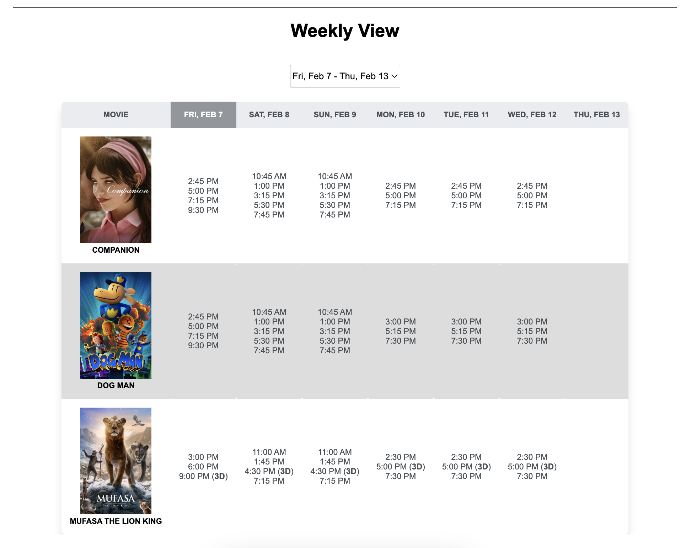

# Silver Star Cinemas Showtime Viewer

### Overview
- The HTML script I developed showcasing a daily and weekly viewer for the showtimes of a local movie theater I help manage.

### Technologies
- HTMl, JS, CSS
- Google Cloud, Google Firestore Database
- TMDB API

## What I learned
- These different web technologies can be used side-by-side in just a single script.
- Production code needs to undergo rigerious testing in extreme enviroments (things the developer is not accounting for)

## Future Improvements
- I plan to integrate a few other APIs to help make the program more reliable and streamlined.

# Images:

